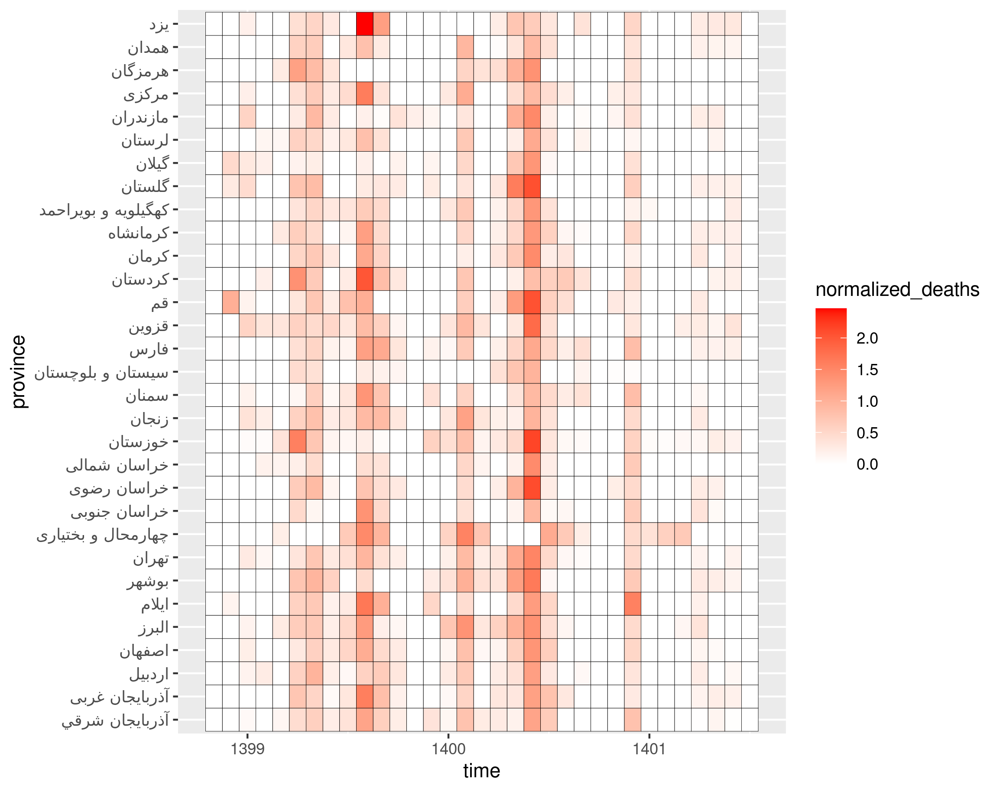
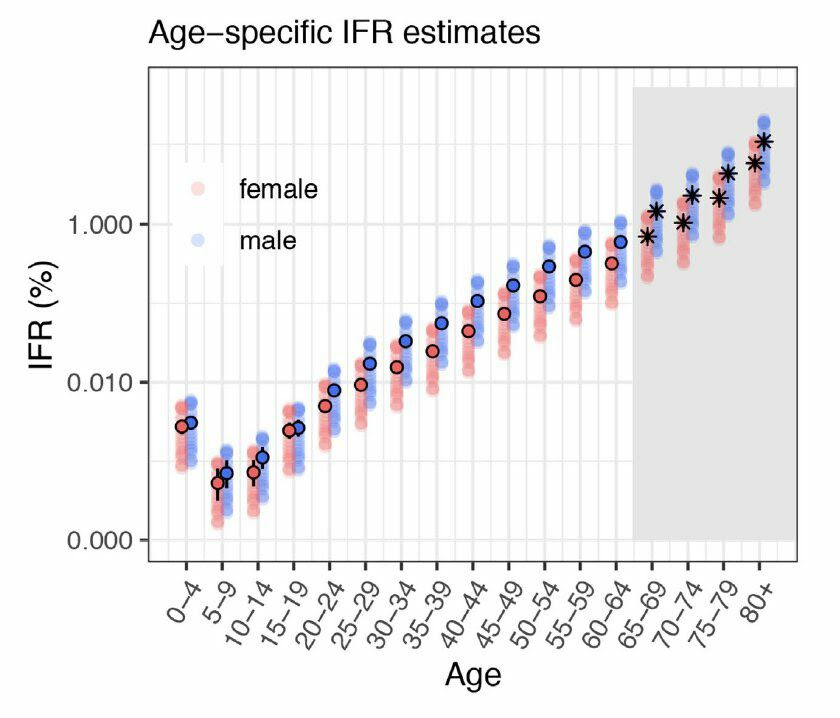
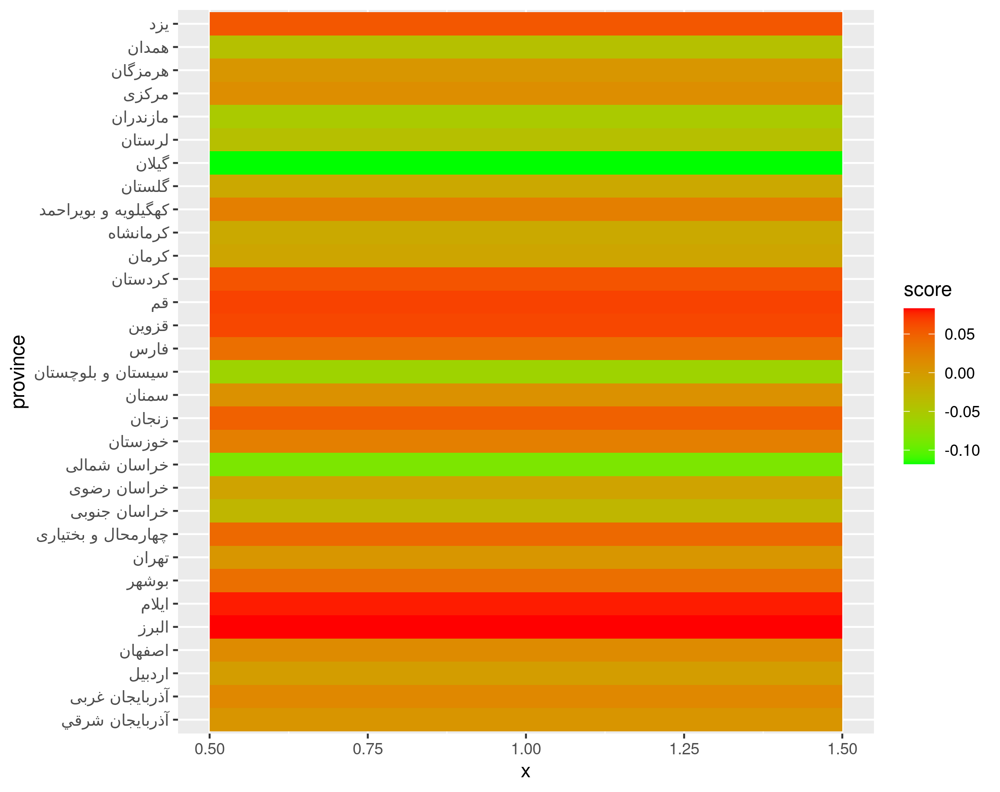

# **Covid Excess Death**
*By Amirsalar Safaei Ghaderi 99100177*
<!-- TOC -->
* [**Covid Excess Death**](#covid-excess-death)
  * [How to run](#how-to-run)
  * [Question 1](#question-1)
  * [Question 2](#question-2)
  * [Question 3](#question-3)
* [Thanks for your time :D](#thanks-for-your-time-d)
<!-- TOC -->

## How to run
- Open **`solution.R`** and replace `$` in

    `base_folder <- "$" # change this:)`
    
    with absolute path of project folder in format of your operating system and run the whole code. 
    
    Doing this will automatically install packages, create and save the heatmaps and the tables to the **`base_folder`** that was defined.

- comment the first line for multiple runs so it doesn't install packages every time

- You must include **`iranprovs_mortality_monthly.csv`** in root of the project.

- My outputs can be find in **`./output`** folder.

## Question 1
my answer was `256731`
I used bit-masking to check every possible aggregation and feature selection.

I modified age feature by eda-ing which you can see in **`eda.R`**, 
encoded sex feature as a categorical feature and added season and month in season for more aggregation possibilities.

## Question 2
you can see the answer in **`provinces-death.csv`** file. I used [Question 1](#question-1)s answer and aggregated it by province.

| excess\_death    | normalized\_death | predicted\_deaths |               استان |
|:-----------------|:------------------|:------------------|--------------------:|
| 16164.372548887  | 0.251759958684038 | 64205.4941277357  |      آذربايجان شرقي |
| 11127.0935430602 | 0.249102955576034 | 44668.6532374917  |      آذربايجان غربی |
| 4424.63063766886 | 0.222402700884244 | 19894.6803257205  |              اردبیل |
| 17019.0446711328 | 0.244156412233239 | 69705.4995011755  |              اصفهان |
| 10337.8686947532 | 0.315128918814224 | 32805.2047195568  |               البرز |
| 1756.17976190477 | 0.270646855802617 | 6488.82380952379  |               ایلام |
| 3122.92857142857 | 0.262600575161389 | 11892.3142857143  |               بوشهر |
| 46157.8173409    | 0.272229830379433 | 169554.590239304  |               تهران |
| 2740.33295826339 | 0.252797692307322 | 10840.0236301683  |  چهارمحال و بختیاری |
| 1624.6419282932  | 0.146071898338662 | 11122.2072607458  |        خراسان جنوبی |
| 20975.6937081055 | 0.238164087732869 | 88072.4457989332  |         خراسان رضوی |
| 2103.81205625009 | 0.151552465144739 | 13881.7409155362  |        خراسان شمالی |
| 16219.7239212282 | 0.278054581777288 | 58332.8777305299  |             خوزستان |
| 3809.13184529097 | 0.265656368049152 | 14338.567801944   |               زنجان |
| 2157.51562174279 | 0.217290793817095 | 9929.16259286568  |               سمنان |
| 3889.37066488741 | 0.108054619191804 | 35994.4877320193  |   سیستان و بلوچستان |
| 16384.1177683715 | 0.266701016441287 | 61432.528405749   |                فارس |
| 4977.90802499206 | 0.28393044750523  | 17532.13883446    |               قزوین |
| 5070.37809126025 | 0.295614420857032 | 17151.9984598871  |                  قم |
| 5881.87692307693 | 0.282926832878159 | 20789.3923076923  |             کردستان |
| 7625.59829660447 | 0.189845874929512 | 40167.3109802137  |               کرمان |
| 7014.44695968735 | 0.223758928987322 | 31348.2326333659  |            کرمانشاه |
| 1489.17199396997 | 0.183727173169129 | 8105.3442900312   | کهگیلویه و بویراحمد |
| 6476.77599270467 | 0.251088017964619 | 25794.8429606757  |              گلستان |
| 6817.71340827685 | 0.141305884285138 | 48247.9087319502  |               گیلان |
| 4427.76716543038 | 0.168021702458145 | 26352.352705945   |              لرستان |
| 9691.38585424311 | 0.196378775282849 | 49350.4750718826  |            مازندران |
| 4951.16088786975 | 0.229395410465708 | 21583.5219973151  |               مرکزی |
| 3374.15934065934 | 0.184747513606435 | 18263.625175748   |             هرمزگان |
| 5475.09321253241 | 0.176503080603505 | 31019.8167296105  |               همدان |
| 3443.49221081875 | 0.249828116342599 | 13783.4454393298  |                 یزد |

I drew a heatmap by normalizing, excess death (dividing it by predicted deaths); It's named **`heatmap-provinces-by-time.png`** and red means more excess death.

## Question 3

By the image above we can conclude that age 45 till 80 is more prune to death by covid (higher than that can be noisy). I made linear model predicting 
each province excess death by pre covid death of said age group. The fited model had an Adjusted R-squared of `0.9623`.

Then I scored each province by their residual to the said line and normalized it like [Question 2](#question-2). 
I drew a heatmap named **`provinces-performances.png`** green means better performance. 

We can see that some provinces like `گیلان` and `خراسان شمالی` were better than others and some provinces like `ایلام` and `البرز` were worse.
And yes there is substantial difference between them.

| score                | استان               |
|:---------------------|:--------------------|
| -0.117921511656693   | گیلان               |
| -0.0861715218356684  | خراسان شمالی        |
| -0.062607369978038   | سیستان و بلوچستان   |
| -0.0521672770563369  | مازندران            |
| -0.0411922713706035  | همدان               |
| -0.0394093939940929  | لرستان              |
| -0.029085963474852   | خراسان جنوبی        |
| -0.0155930558550585  | کرمانشاه            |
| -0.0143619540070557  | گلستان              |
| -0.0110346655274466  | کرمان               |
| -0.00873157665234498 | خراسان رضوی         |
| -0.00324988248981538 | اردبیل              |
| 0.00402348716598945  | هرمزگان             |
| 0.00420365358106597  | تهران               |
| 0.0052984070404647   | آذربايجان شرقي      |
| 0.00881984700179208  | سمنان               |
| 0.0120798389666201   | مرکزی               |
| 0.0150756293671394   | اصفهان              |
| 0.0179440346300615   | آذربايجان غربی      |
| 0.0252781739122741   | کهگیلویه و بویراحمد |
| 0.0257463717014915   | خوزستان             |
| 0.0383499155693316   | بوشهر               |
| 0.0384133205192176   | فارس                |
| 0.0430770127217586   | چهارمحال و بختیاری  |
| 0.0492159947805244   | زنجان               |
| 0.0553977045676227   | یزد                 |
| 0.0575456755173814   | کردستان             |
| 0.0642266488379919   | قزوین               |
| 0.06670063487863     | قم                  |
| 0.079467806875571    | ایلام               |
| 0.0829631683496146   | البرز               |

There is also a table called **`provinces-scores.csv`** containing the scores and sorted from best performance to least performance.

_lower score means better performance. For example negative score is better than expected._

# Thanks for your time :D
